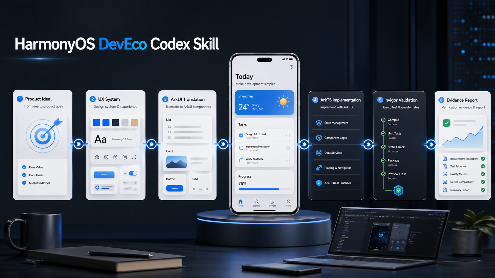

# HarmonyOS DevEco Agent Skill



Codex and Claude Code plugin package for HarmonyOS / DevEco Studio work. It turns product ideas, UI plans, screenshots, ArkUI implementation tasks, build errors, signing checks, and device evidence requests into small, explicit checkpoints.

## What Is Included

- `skills/harmonyos-deveco/`: the shared agent skill, references, scripts, and OpenAI agent metadata.
- `prompts/harmonyos-*.md`: Codex slash prompt shims for low-friction commands.
- `commands/harmonyos-*.md`: Claude Code plugin commands for the same checkpoints.
- `.codex-plugin/plugin.json`: plugin manifest for Codex plugin packaging.
- `.claude-plugin/plugin.json`: plugin manifest for Claude Code.
- `.claude-plugin/marketplace.json`: Claude Code marketplace metadata for GitHub distribution.
- `scripts/install.ps1`: local installer for skills and prompt shims.
- `scripts/validate-package.ps1`: repository structure validator.
- `plugins/zhipu-glm-agent-plugin/`: optional Zhipu AI / BigModel GLM MCP plugin for Codex and Claude Code.

Large generated documentation caches are intentionally not committed:

- `skills/harmonyos-deveco/references/docs/`
- `skills/harmonyos-deveco/references/contest/raw/`
- `skills/harmonyos-deveco/references/docs.sqlite`
- `skills/harmonyos-deveco/references/docs-index.jsonl`

Regenerate those locally if you need offline HarmonyOS doc search.

## Checkpoint Commands

Codex installs these as bare slash commands. Claude Code plugins namespace commands by plugin name, so `/harmonyos-ideal` becomes `/harmonyos-deveco-agent-skill:harmonyos-ideal`.

| Codex Command | Claude Code Command | Purpose |
| --- | --- | --- |
| `/harmonyos-ideal` | `/harmonyos-deveco-agent-skill:harmonyos-ideal` | Capture product promise, target user, scene, temperament, non-goals, and evidence target. |
| `/harmonyos-ux` | `/harmonyos-deveco-agent-skill:harmonyos-ux` | Map first viewport, core journey, pages, states, entry points, and safety gates. |
| `/harmonyos-system` | `/harmonyos-deveco-agent-skill:harmonyos-system` | Produce ArkUI-ready design tokens, accessibility, dark mode, motion, and component roles. |
| `/harmonyos-arkui` | `/harmonyos-deveco-agent-skill:harmonyos-arkui` | Convert product/UI/design context into an ArkUI Landing Contract. |
| `/harmonyos-implement` | `/harmonyos-deveco-agent-skill:harmonyos-implement` | Make focused ArkTS/ArkUI changes in a DevEco project. |
| `/harmonyos-verify` | `/harmonyos-deveco-agent-skill:harmonyos-verify` | Check build, signing, Preview, device, route, permission, and artifact evidence. |
| `/harmonyos-report` | `/harmonyos-deveco-agent-skill:harmonyos-report` | Write a concise handoff report with changed files, evidence, and remaining risks. |
| `/harmonyos-fix` | `/harmonyos-deveco-agent-skill:harmonyos-fix` | Debug build/runtime/signing/permission/resource/navigation errors. |
| `/harmonyos-contest` | `/harmonyos-deveco-agent-skill:harmonyos-contest` | Plan HarmonyOS innovation contest work with contest-aware Kit/API constraints. |
| `/harmonyos-all` | `/harmonyos-deveco-agent-skill:harmonyos-all` | Run the full path only when the user explicitly wants it. |

## Install For Codex

From this repository root:

```powershell
.\scripts\install.ps1
```

To install into a custom Codex home:

```powershell
.\scripts\install.ps1 -CodexHome "C:\Users\you\.codex"
```

The installer copies:

- `skills/harmonyos-deveco` to `$CodexHome\skills\harmonyos-deveco`
- `prompts/harmonyos-*.md` to `$CodexHome\prompts`

Restart or reopen Codex if newly added slash prompts are not visible immediately.

## Use With Claude Code

For local development, load this repository directly as a Claude Code plugin:

```powershell
claude --plugin-dir .
```

Then run a namespaced command, for example:

```text
/harmonyos-deveco-agent-skill:harmonyos-ideal Capture this app idea
```

For marketplace-style installation from GitHub, add this repository as a Claude Code marketplace and install the plugin:

```text
/plugin marketplace add 1635032352-lgtm/harmonyos-deveco-agent-skill
/plugin install harmonyos-deveco-agent-skill@harmonyos-deveco-agent-skills
```

## Optional Zhipu GLM Plugin

This repository also includes `plugins/zhipu-glm-agent-plugin`, a separate MCP-backed plugin for calling Zhipu AI / BigModel GLM chat completions.

Set the API key before starting Codex or Claude Code:

```powershell
$env:ZHIPUAI_API_KEY = "your-api-key"
```

Claude Code marketplace install:

```text
/plugin marketplace add 1635032352-lgtm/harmonyos-deveco-agent-skill
/plugin install zhipu-glm-agent-plugin@harmonyos-deveco-agent-skills
```

Claude Code command:

```text
/zhipu-glm-agent-plugin:glm-chat 用中文总结这段设计方案
```

The MCP tool is `glm_chat`. It defaults to `glm-4.7` and `https://open.bigmodel.cn/api/paas/v4`.

## Optional Local Docs Index

If you have a local HarmonyOS documentation corpus, rebuild the searchable index from the repository root:

```powershell
python .\skills\harmonyos-deveco\scripts\build_local_index.py --source-root "D:\harmonyOS文档"
```

Then use:

```powershell
python .\skills\harmonyos-deveco\scripts\search_docs.py "module.json5 permissions"
```

The generated docs and indexes are ignored by Git by default.

## Validate Before Publishing

```powershell
.\scripts\validate-package.ps1
```

Expected result:

```text
PACKAGE_CHECK PASS
```

## Publish To GitHub

```powershell
git init
git add .
git commit -m "feat: add HarmonyOS DevEco agent skill"
git branch -M main
git remote add origin https://github.com/1635032352-lgtm/harmonyos-deveco-agent-skill.git
git push -u origin main
```

If the remote repository does not exist yet, create an empty GitHub repository named `harmonyos-deveco-agent-skill` first, then run the remote/push commands.
